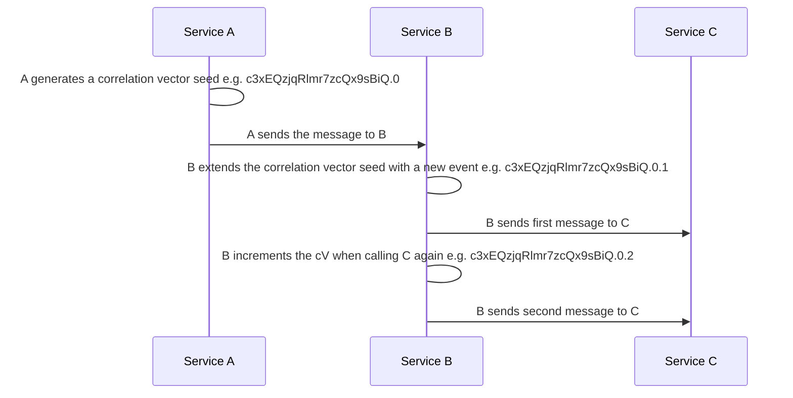

## CorrelationVector for Rust
CorrelationVector-Rust provides the Rust implementation of the CorrelationVector protocol for tracing and correlation of events through a distributed system.

## CorrelationVector
### Background
Correlation Vector (a.k.a. cV) is a format and protocol standard for tracing and correlation of events through a distributed system based on a light weight vector clock. The standard is widely used internally at Microsoft for first party applications and services and supported across multiple logging libraries and platforms (Services, Clients - Native, Managed, Js, iOS, Android etc). The standard powers a variety of different data processing needs ranging from distributed tracing & debugging to system and business intelligence, in various business organizations.

For more on the correlation vector specification and the scenarios it supports, please refer to the [specification repo](https://github.com/microsoft/CorrelationVector).

### Features
#### Seed
Generates a new correlation vector.
```rust
CorrelationVector::new();
```
#### Extend
This adds a new counter in the vector clock.
```rust
let mut cv = CorrelationVector::new();
cv.extend();
```

#### Increment
This increments the latest counter in the vector clock.
```rust
let mut cv = CorrelationVector::new();
cv.increment();
```

#### Spin
This is the most complex function of the CorrelationVector. Spin changes the correlation vector such that the result should be unique and monotonically increasing without locking/atomic operations. It is used when the parent span is not able to atomically increment the vector clock for each child span.

```rust
let mut cv = CorrelationVector::new();
cv.spin();
```


### Explanation and example
The CorrelationVector contains a base-64 encoded uuid and a vector clock. The uuid is used to identify the vector clock and the vector clock is used to track the sequence of events.



This allows us to track the sequence of events in a complex distributed system.

### Disclaimer
I work for Microsoft and use CorrelationVectors but am not associated with the CorrelationVector team. This repo should *not* be considered a reference implementation of the CorrelationVector specification.